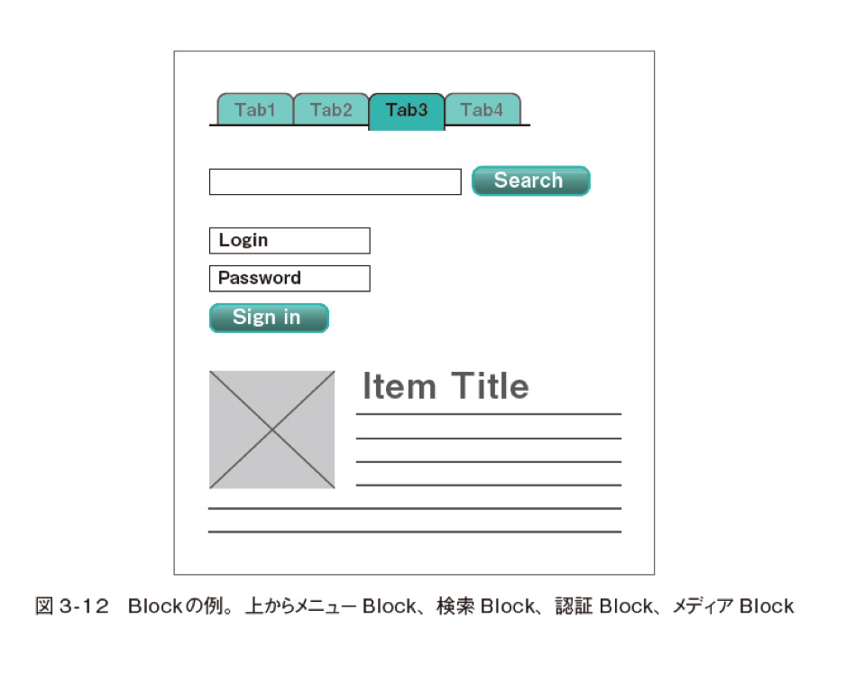
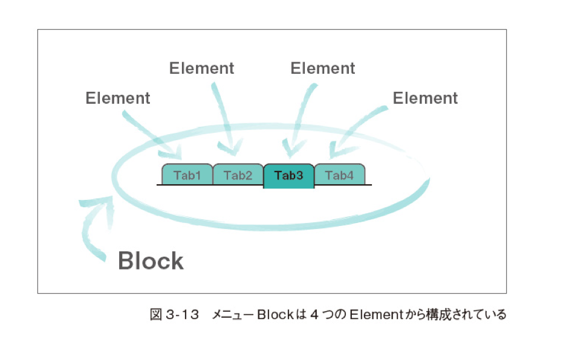
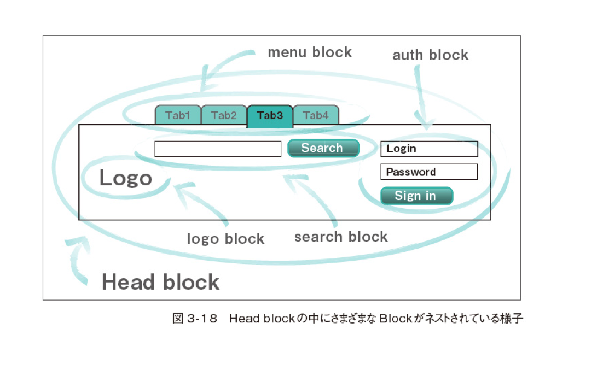

# BEM (Block, Element, Modifier)

User interface を独立した block に落とし込んでいくことで、複雑な page であっても開発を簡単かつ、素早く行うことを目的としています。

OOCSS のように基本的に module を base にした方法論であるものの、その内容は他の設計手法に比べ厳格・強力です。そのため世界的にも OOCSS に匹敵するほど名前が知られ、利用されています。本性をお手に取られた方でも、名前だけは聞いたことがある人は多いのではないでしょうか。

BEM では名前の通り、module を

- Block
- Element
- Modifier

という単位で分解し、定義しています。また**これら Block・Element・Modifier をまとめて 「BEM Entity」 と呼びます。**

## Rule

- 要素系 Selector や ID Selector の使用は推奨されません。 Class selector の使用が基本になります。
- 詳細度を均一にする
- Block, Element, Modifier の命名
  - Block と Element は class の名前が主に 「それが何であるか」 ということを重視している
  - Modifier は 「それがどうであるか」 を重視する
- Blockå
  - Layout に関する style(周りに影響を及ぼす position や float, margin など)をしてはいけません。
  - Class 名は半角英語数字の小文字で、複数の単語は hyphen でつなぐ
  - Block の nest は許容する
- Element
  - BEM では Element の中に Element が nest された命名を推奨していません
  - Element は必ず Block 内に配置する
  - Element の nest は推奨しない
  - Element はなくても良い
    - Element はあくまで 「Block を構成する option 要素」 の位置付けであるので、必ずしも Element を持たなければいけないわけではありません acti
- Modifier
  - Modifier は 「Block もしくは Element の見た目や状態、ふりまいを定義するもの」 と定義されていませう。また Block、もしくは Element に対する Option 要素という位置付けであるため、必ず必要なものではありません。

## Block の基本

BEM における Block は 「論理的 & 機能的に独立した page module」 と定義されています。要は 「特定の context に依存していない、どこでも使いまわせる parts」 と捉えて良いでしょう

「どこでも使いまわせる」 という状態を担保するために、Block 事態に Layout に関する style(周りに影響を及ぼす position や float, margin など)をしてはいけません。 Layout に関する指定が必要な場合は、御述する Mix というテクニックを用いて実装します。



Block の名目規則

- 単語が 1 つの場合
  - format: block
  - ex. `menu`
- 単語が複数の場合(hyphen で繋ぐ)
  - format: `block-name`
  - ex. `global-nav`

## Element の基本

Block の次の単位となる Elemnt は 「Block を構成し、Block の外で独立して使用できないもの」 と定義されています。先ほど Block の例として挙げた menu block は以下の図のように 4 つの Element で構成されているということになります。



Element class 名は、Block の名前を継承し、under score ２つを記述した後に Element の名前をつけます。

Element の名目規則

- 単語が 1 つの場合
  - foramt: `block__element`
  - ex. `menu__item`
- 単語が複数の場合(underscore ２つをで繋ぐ)
  - foramt: `block-name__element-name`
  - ex. `global-nav__link-item`

### Element の nest

BEM では Element の中に Element が nest された命名を推奨していません。これは

- Block 内で Element が移動することがある
- いくつかの Element がない状態で、使われることがある
- Element を後から追加することがある

など、Block ないの構造が変わる可能性があるからです。

## Modifier の基本

Modifier は 「Block もしくは Element の見た目や状態、ふりまいを定義するもの」 と定義されていませう。また Block、もしくは Element に対する Option 要素という位置付けであるため、必ず必要なものではありません。

Modifier の名目規則

- 単語が 1 つの場合
  - foramt: `block__element_modifier`
  - ex. `menu__item_actived`
- 単語が複数の場合(underscore 1 つをで繋ぐ)
  - foramt: `block-name__element-name_modifier-name`
  - ex. `global-nav__link-item_actived-and-focused`

Modifier の名目規則(key と値の組み合わせ)

- 単語が 1 つの場合

  - ex. 「text_large」 の場合 `text` が key, `large` が value
    - `menu__item_text_large`

- 単語が複数の場合
  - ex. 「color-theme_caution」 は `color-theme` が key, `caution` が value
    - `global-nav__link-item_color-theme_caution`

### Modifier の type

- 審議値
  - disabled, focused, actived など
- key と value の pair
  - ex. `text_large`
- 振る舞い
  - ex. `directions_right-to-left`

## Block の Nest

Block は、他のあらゆる Block の中に Nest して設置することができます。この nest の数に特に上限はなく、いくらでも nest して良いことになっています。 図のように、一番大きな枠として Header block がある、その中に menu, logo, 検索, 認証など各種 Block を埋め込むのは BEM が推奨している手法です。



## Mix

Mix は 「単一の DOM node に、異なる BEM Entity が複数付加された」 と定義されており、誤解を恐れずに噛み砕いて言えば**「一つの HTML 要素に、役割の異なる複数の Class がついている状態」** ということができます。

Mix を行うことにより、

- Code を複製することなく、複数の BEM Entity の振る舞いや Style を組み合わせる
- 既存の BEM Entity から、新しい module を作成する。
  - 意味を持つ interface conponent となる

ことができるようになります。

## その他

### Mix か Modifier か

Block (または Element) の振る舞いや style を変更する場合、 「Mix にすべきか Modifier にすべきか」 と悩むこともあるでしょう。先に結論から言ってしまうと、これは変更する CSS の property である程度方針を分けることができます。

- Mix を使用する場合
  - Position や Margin など、「Layout (他の要素との位置関係を整理する)に絡む」 変更の場合
- Modifire を使用する場合
  - Layout ではなく、その Block(または Element) 内で完結する変更の場合

### Group selector の代わりに Mix

- そもそも最初から group selector を使わず、無理に Mix も行わない
- Mix をするのであれば、上書きは Mix をした Block も Modifier で行う

```css
/* group selector */
.header,
.footer {
  font-familty: Arial, sans-serif:
  font-size: 14px;
  color: #000
}

/* そもそも最初から group selector を使わず、無理に Mix も行わない */
.header{
  font-familty: Arial, sans-serif:
  font-size: 14px;
  color: #000
}

.footer {
  font-familty: Arial, sans-serif:
  font-size: 14px;
  color: #000
}
```

### Mix では対処できない場合

- Element の中に他の Block を nest する
- Context に依存する styling を行う
  - ex. CMS の WYSIWYG(What You See Is What You Get) Editor

### 名前が衝突することにより、Modifier の詳細度が増す

### どの class に対する Modifier か見分けがづかない

### Code が検索しづらい

### BEM のその他の命名規則

- BEM の標準の命名規則 `block-name__elem-name_mod-name_mod-val` のように
  - 英数字の小文字
  - Element と Modifier はそれぞれ Block のなめを継承する
  - それぞれの区切りの中に複数の単語がある場合は hyphen 1 つ
  - Block と Element の区切りは underscore ２つ
  - Modifier の key の区切りは underscore 1 つ
  - Modifir の値の区切りは underscore 1 つ

### MindBEMding

```html
<!-- BEM 本来の Modifier の書き方 -->
<a class="button button_size_s" href="#">button</a>

<!-- MindBEMding で紹介されている Modifier の書き方 -->
<a class="button button--s" href="#">button</a>
```

### BEM を成功させるコツ

- DOM model ではなく、Block という単位を Base に考えましょう
- ID Selector と要素系 Selector は使用しないようにしましょう
- 子(孫) selector で nest される Selector の数は、なるべく少なくしましょう
- 名前の衝突を避けるために、また code から情報が読み取れるように、命名規則にきちんと従った Class 目をつけましょう
- Block なのか、Element なのか、Modifier なのかを常に意識しましょう
- Block または Element で変更が頻繁に起こりそうな Style の property は、Modifier に移しておきましょう
- Mix を積極的に使用しましょう
- 管理性を高めるために、Block は 1 つ 1 つがなるべく小さくなるように分割しましょう
- Block を積極的に再利用しましょう

## Link

- [bem](https://en.bem.info/)
- [BEM syntax](https://csswizardry.com/2013/01/mindbemding-getting-your-head-round-bem-syntax/)
