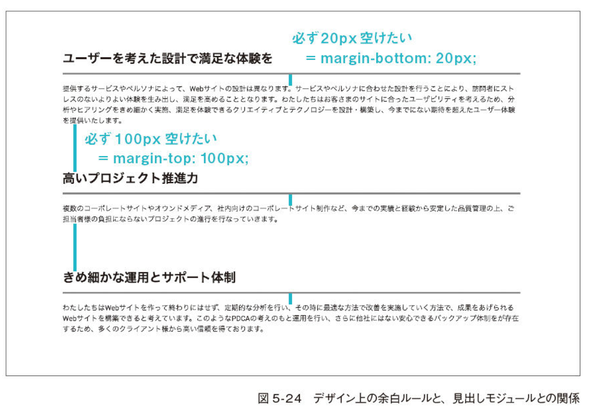
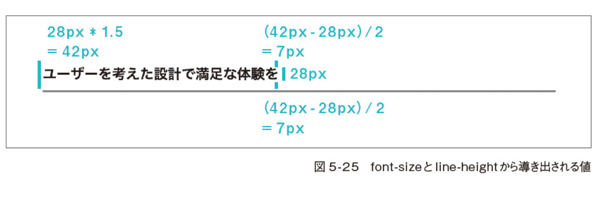

# Memo

## ID selector の利点 (class selector より)

javascript で要素を ID 属性経由で取得する際、class 属性経由での取得に比べ performance が向上します。

## css

```css

.btn:nth-of-type(2) {
  width: 160px'
}

p:first-of-type {}

p:last-of-type {}

.is-error::placeholder {}

.tabnav > li:first-child {}
```

## 見出しと余白の関係

再利用性と汎用性を保つために、margin を含む 「layout に関する styling」 は原則として module 事態に行うべきではありません。
しかし、「見出しが使われる状況」 というのは 「新たに section を形成したい 」という状況であり、「セクションとセクションの間は、必ず決まった値の余白を設けるという design 上の規則が作成されることが多いです。



## Text と余白の関係

- `font-size(1.75rem = 28px) X line height (1.5) = 요소 높이`
- half-leading: 14px (7px X 2)


