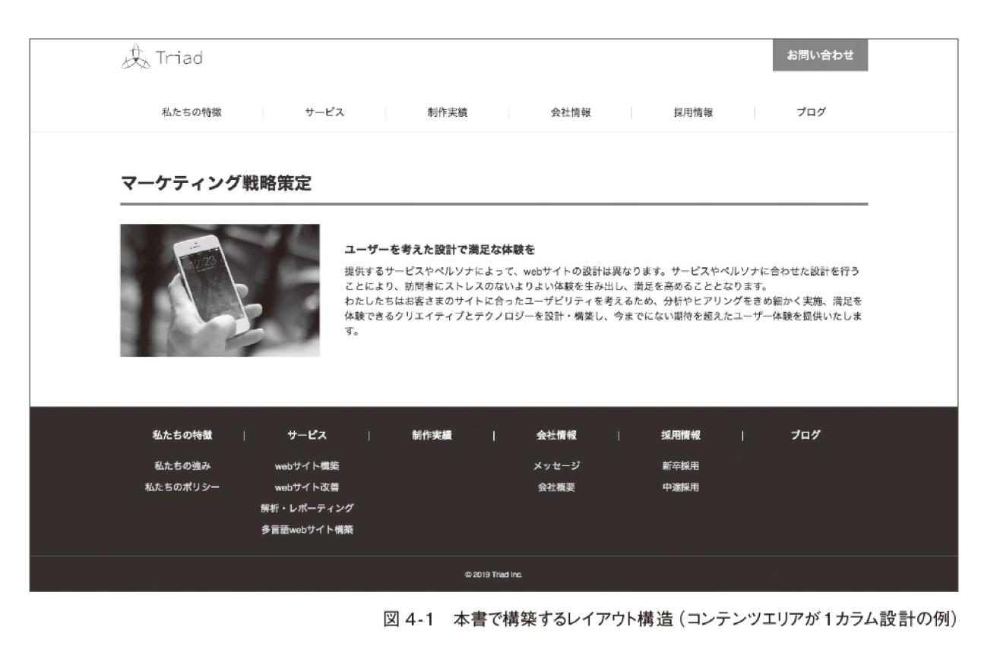
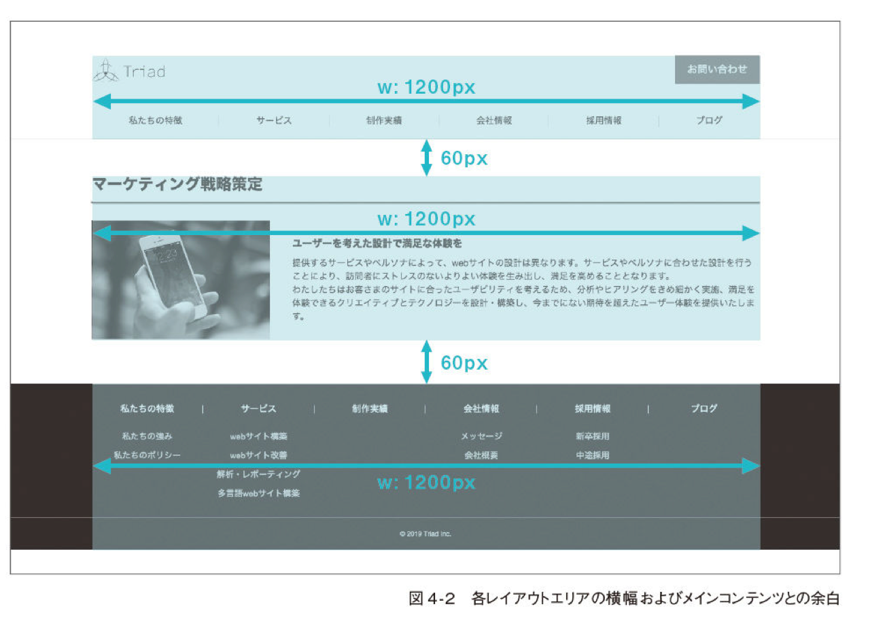
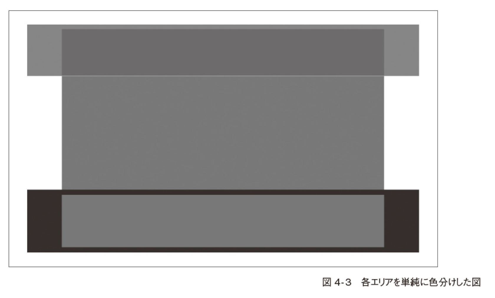
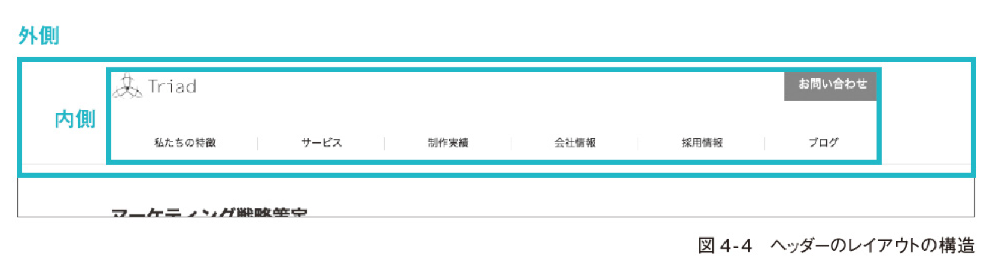
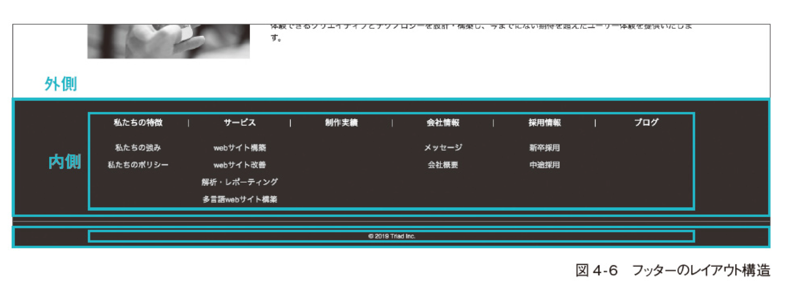
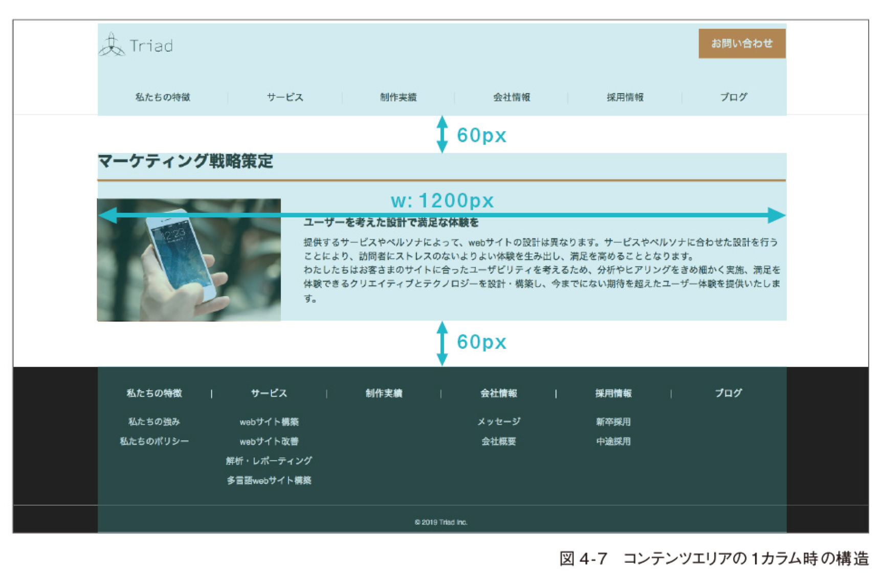
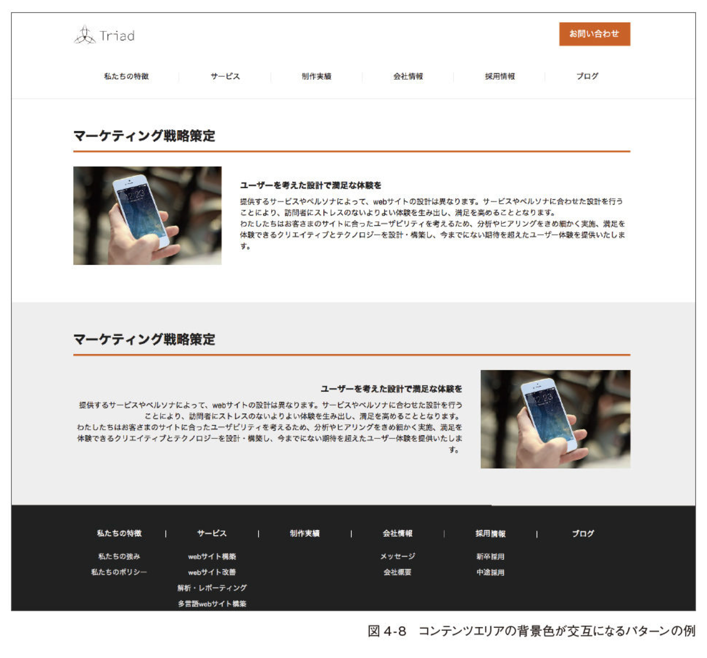
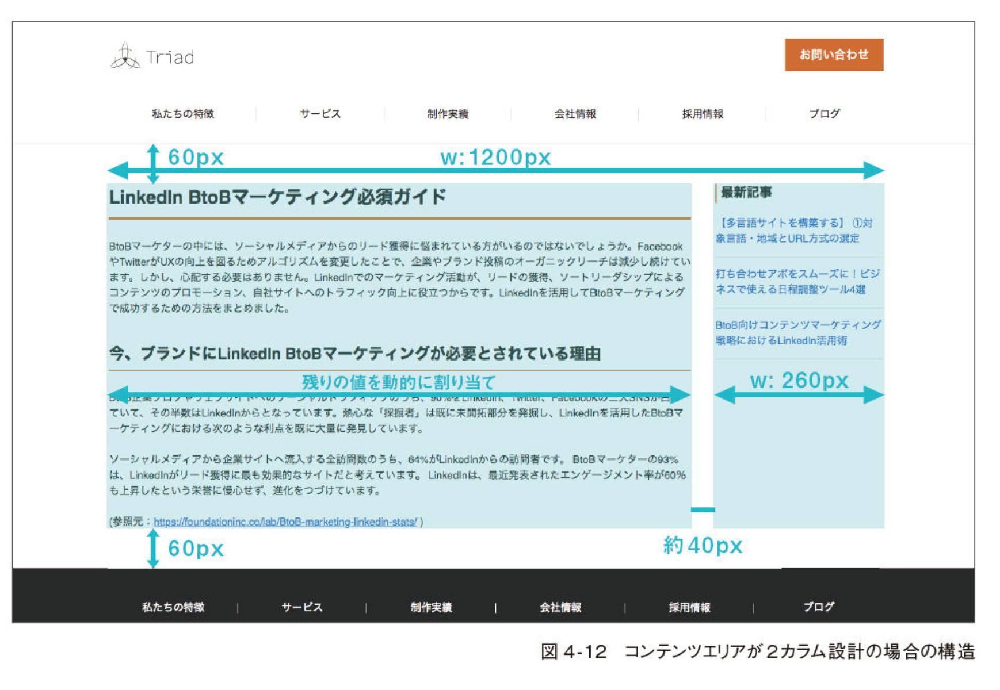

# Summary

## Goal

## Code Scope

Chapter 4 ~ Chapter 7 の code 前提

## Project Summary

- Code 前提として

  - 使用する reset CSS
  - 独自に定義した base style
  - 使用する設計手法

| Item      | Content                                                      |
| --------- | ------------------------------------------------------------ |
| Reset CSS | hard reset 系の [wipe](https://github.com/stackcss/css-wipe) |
| icon      | Font Awesome (ver. 5.6.3)                                    |

- Layouts
  - 横幅: 1200px
  - content layout, header, footer 間の余白: 60px

- Structure
  - Header
  - Footer
  - Content Area
    - 1 column
    - 2 column

イメージとしたら以下ようになったら OK

### Header

- 外測
  - header 全体を全体を括る要素。上部の余白の確保と、content area との境界となる boarder を実装
- 内側
  - haeder 内において、content area と同等の横幅を実装

### Footer

### Content Area

